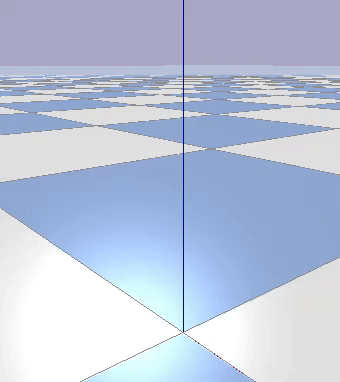

# Furuta Pendulum

 

This project is an educational exploration of various aspects of robotics such as motor control, simulation and machine learning.

The inverted pendulum was chosen as a means to motivate this exploration.  This project culminates in the construction and balancing of a rotational inverted pendulum, known as a [Furuta](https://en.wikipedia.org/wiki/Furuta_pendulum) pendulum.

## Source Overview

/odrive
- Scripts to characterize brushless DC motor control

/simple
- Balancing a simple pendulum using OpenAI Gym and PPO2

/furuta
- Balancing a Furuta pendulum using various RL algorithms
- A class hierarchy was developed to facilitate exploration of RL algorithms and control paradigms
- Libraries to implement various sim-to-real strategies, and calculate moments of inertia of the pendulum

## Motor Control
The following aspects of motor characterization were explored:
- Rotor moment of inertia
- Drag
- Torque ripple

The following aspects of motor control were explored:
- Control via position, velocity, torque
- Throttle profiles: binary, linear, exponential
- PID loop tuning and development

## Machine Learning

DQN, PPO2 and TRPO algorithms were used, as well as the [NEAT](https://neat-python.readthedocs.io/en/latest/) evolutionary algorithm.

The following aspects of ML were explored:
- Network dimensions
- Discrete vs. continuous output (linear vs. logistic regression)
- Number of logistic regression classes and class values (binary, linear, logarithmic) 
- Position control vs. torque (current) control
- Discrete vs. monolithic policies for pendulum spin-up and balance
- Sample efficiency (experience replay) and training time
- Parallelization and training time

The following aspects of the reward function were explored:
- Linear, quadratic, trigonometric and sigmoid functions
- Pendulum angle, rotor angle, network activation and their time derivatives
- Spin-up time

## Reality Gap

The following methods to bridge the reality gap were explored:
- Dither: randomly vary the physical properties of the pendulum across training sessions
- Noise: randomly vary sensor data
- Latency: randomly sample from a set of communication latency measurements; add random inference time
- Ripple: generate a random torque ripple map for each training session
- Network: train a simple MLP to emulate physical system response to control input for use in training
- Haze: apply random torque to pendulum during training

## System
### Hardware

- Motor: Turnigy Air 3730 BLDC; 1000KV; 580W; 0.347Nm
- Encoder: CUI AMT102-V; 2048 PPR resolution; +/-0.25 degree 
- Motor controller: ODrive V3.6 24V FOC

The pendulum, rotor and base are all constructed from 12mm x 1mm square aluminum tubing.  Cartridge bearings are press fit into the tubes.  The motor’s solid axle was replaced with stainless steel tubing to accommodate sensor wiring; a short piece of silicone tubing serves as a flexible coupler between the axle and slip ring.
### Software

Python, NumPy, URDF, OpenAI Gym, Stable Baselines (DQN, PPO2, TRPO), TensorFlow, PyBullet

- Training: AWS EC2 c5.4xlarge; Intel Xeon 16 core 3.6GHz
- Inference: Intel NUC 7; Celeron Dual Core 2.0GHz; Ubuntu 18.04 LTS
